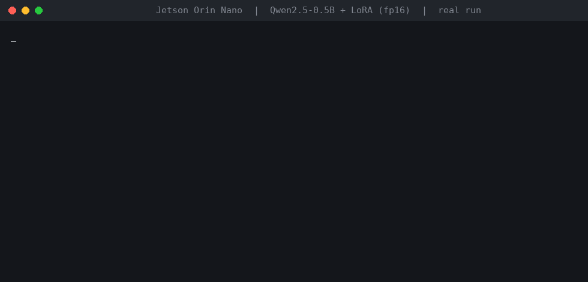

# IELTS Essay Band Predictor — LoRA-tuned Qwen2.5-0.5B, quantized and run on a Jetson Orin Nano

[](https://kaggle.com/kernels/welcome?src=https://github.com/ahmedvictor507/ielts-essay-grader-lora/blob/main/kaggle_demo.ipynb)
[](https://huggingface.co/Viktor507/ielts-band-predictor-0.5b)
[](https://huggingface.co/spaces/Viktor507/IELTS-Band-Predictor)
[](LICENSE)

A small open-weight language model, fine-tuned with LoRA to read an **IELTS Writing Task 2** question and essay and answer with the overall band as **strict JSON**. The project covers the whole loop: data cleaning, LoRA training, evaluation against baselines with confidence intervals, quantization (fp16 / int8 / 4-bit), and on-device inference on an NVIDIA Jetson Orin Nano.



*Recorded from a real run of `python demo.py` on the Orin Nano (text and timings are the real output; playback is sped up). The three essays are synthetic, written for the demo at weak / mid / strong levels. Three hand-picked essays prove nothing by themselves — the measured results are below.*

```json
{"overall": 6.5}
```

> **Scope, stated plainly.** This predicts an **overall band only**. It was trained on **model-generated labels**, not examiner scores, so it measures agreement with a larger model's grading, not with human examiners. It is a moderate ranking signal, not a calibrated or official score. Do not use it for real exam decisions.

## Try it on your own essay
- **Kaggle (no setup):** click *Open in Kaggle* above, turn **Internet on**, run the cells, and paste your own essay in the last cell. CPU is fine for a 0.5B model.
- **Locally:** see [Quickstart](#quickstart). A Gradio app with input guardrails is in [`gradio_demo/`](gradio_demo/) (`python gradio_demo/app.py`).
- **Model and project page on Hugging Face:** [model](https://huggingface.co/Viktor507/ielts-band-predictor-0.5b) (weights + model card) and a [static project page](https://huggingface.co/spaces/Viktor507/IELTS-Band-Predictor). A live hosted demo is not offered because Gradio Spaces on free CPU now require a Hugging Face PRO subscription.

## Results

Held-out = 300 essays from the cleaned Hugging Face data, split **by prompt** so no question appears in both train and eval. External = 300 essays from a separate Kaggle dataset the model never saw. Baselines always predict one constant band.

| | Format valid | MAE (bands) | Within ±0.5 | Pearson r |
|---|---|---|---|---|
| Base model (no fine-tuning), held-out | 15.7% | 2.23 *(only 47% parseable)* | 15.7% | – |
| **LoRA model, held-out** | **100%** | **0.93** | 44.7% | **0.47** |
| Always predict mean (6.5), held-out | – | 1.06 | 42.7% | – |
| Always predict mode (7.0), held-out | – | 1.16 | 37.7% | – |
| **LoRA model, external (Kaggle)** | 100% | 0.77 | 54.7% | **0.54** |
| Always predict mean (6.5), external | – | 0.80 | 55.0% | – |

95% bootstrap CI for the MAE gap to the always-mean baseline (negative = model better): held-out **[−0.195, −0.070]** (significant); external [−0.098, +0.040] (**not** significant).

**What this means.** The model reliably learned the output format (15.7% → 100% valid JSON) and a **moderate ranking signal that held on external data** (r ≈ 0.5). It is **not a calibrated grader**: 241 of 300 held-out predictions are 6.0 or 7.0 while true bands span 4–9, and on the external set it does not beat the always-mean baseline on MAE.

### Quantization (merged model, Tesla T4, batch 1, 100 prompts)

| Variant | Weights | Peak GPU | Format valid | MAE | Pearson r | Latency mean / p99 |
|---|---|---|---|---|---|---|
| fp16 | 942 MB | 1043 MB | 100% | 0.955 | 0.426 | 0.33 s / 0.48 s |
| int8 (bitsandbytes) | 601 MB (−36%) | 703 MB | 100% | 0.940 | 0.457 | 1.37 s / 1.78 s |
| nf4 (bitsandbytes) | 430 MB (−54%) | 553 MB | 100% | 1.035 | 0.433 | 0.46 s / 0.62 s |

Memory dropped as expected and quality differences are within noise at n=100 (so: *no visible breakage*, not *lossless*). With `bitsandbytes` on a T4 both quantized variants were **slower** than fp16 because of dequantization overhead, so the memory saving did not buy speed here. Speed-oriented quantization (GGUF / AWQ / TensorRT-LLM) is on the roadmap.

### On-device: Jetson Orin Nano 8 GB (fp16, batch 1, 50 prompts, ~470 prompt tokens)

| Latency mean / p99 | Time to first token | Decode | Weights / peak GPU |
|---|---|---|---|
| 0.71 s / 0.79 s | 0.12 s | 73.6 ms/token | 942 MB / 986 MB |

The merged model runs on the 8 GB board with the same 100% format validity. Quality figures there use a different prompt subset from the T4 run, so compare latency only loosely (different subset sizes, not a controlled benchmark).

## How it works

```
HF essays (labels = model-generated)  ──▶ clean ▶ dedupe ▶ split by prompt ─┐
                                                                            ├─▶ LoRA SFT (r=16, all linear layers,
Kaggle essays (external test only) ─────────────────────────────────────────┘     completion-only loss, 3,000 essays, 2 epochs)
        │                                                                                │
        ▼                                                                                ▼
   evaluate.py  ◀── merge adapter ◀── quantize_bench.py (fp16 / int8 / nf4) ──▶ bench_jetson.py (on-device)
```

- **Model:** Qwen2.5-0.5B-Instruct, LoRA r=16 / α=32 on q,k,v,o,gate,up,down — **8.8M trainable of 502.8M parameters (1.75%)**. Loss is computed on the JSON answer only.
- **Training:** 73 min on a free Colab T4 (peak 1.74 GiB), 3,000 of the 7,196 cleaned training essays, 2 epochs.
- **Data hygiene (the part that matters most):** the source dataset's own test split turned out to be **100% contained in its train split**, so the data is pooled, invalid bands (`<4`, malformed) dropped, duplicates removed (10,324 → 8,465 essays) and re-split grouped by normalized prompt. The Kaggle set is used only as an external test.
- **Evaluation:** strict-JSON validity, MAE, share within ±0.5 band, Pearson r, and bootstrap CIs against constant baselines. Lenient parsing is used only so the untuned base model can be scored at all.

## Quickstart

```bash
git clone https://github.com/ahmedvictor507/ielts-essay-grader-lora.git && cd ielts-essay-grader-lora
pip install -r requirements.txt        # install torch separately for your hardware

# download the merged model (~1 GB) from the latest release into model-0.5B/
mkdir -p model-0.5B && cd model-0.5B
for f in config.json generation_config.json tokenizer.json tokenizer_config.json chat_template.jinja model.safetensors; do
  wget -q https://github.com/ahmedvictor507/ielts-essay-grader-lora/releases/download/v0.1/$f
done && cd ..

python demo.py                                                    # grade the 3 bundled essays
python demo.py Viktor507/ielts-band-predictor-0.5b                # or load straight from the Hugging Face Hub (skips the download above)
python grader.py --prompt-file examples/prompt.txt --essay-file examples/essay_mid.txt
```

From Python:

```python
from grader import load, grade
model, tok = load("model-0.5B")
grade(model, tok, "<task 2 question>", "<essay text>")
# {'band': 6.5, 'raw': '{"overall": 6.5}', 'valid': True, 'words': 229, 'seconds': 0.69, 'warning': None}
```

Essays outside 100–600 words (the range seen in training) return a `warning`.

## Reproduce training and evaluation

```bash
python download_data.py       # HF dataset -> hf_train.jsonl / hf_test.jsonl
# download the Kaggle "IELTS writing" CSV to archive/ielts_writing_dataset.csv
python prepare_data.py        # clean, dedupe, split by prompt -> data/{train,eval,kaggle_test}.jsonl

python train_lora.py --model Qwen/Qwen2.5-0.5B-Instruct --max-train 3000 --epochs 2 --out lora-0.5b   # GPU (T4 is enough)
python evaluate.py --name base                                   # untuned baseline
python evaluate.py --name lora --adapter lora-0.5b               # tuned model, held-out
python evaluate.py --name lora-kaggle --adapter lora-0.5b --data data/kaggle_test.jsonl --limit 300
python quantize_bench.py --adapter lora-0.5b --limit 100         # merge + fp16/int8/nf4 comparison
python bench_jetson.py --limit 50                                # on-device latency (Jetson)
```

Raw outputs of every run are in [`results/`](results/); the full write-up is in [WRITEUP.md](WRITEUP.md). **Data is not redistributed:** the Hugging Face dataset declares no license, so check each dataset's terms before reuse.

### Jetson notes (things that cost me time)
- Don't let pip install `nvidia-cublas-cu12`/CUDA-12.9 libraries next to a JetPack 6 (CUDA 12.6) torch wheel: `cublasCreate` then fails with `CUBLAS_STATUS_ALLOC_FAILED`. Use the JetPack wheel and the system CUDA libraries.
- On the shared-memory 8 GB board, a large page cache can make GPU allocation fail (`NvMapMemAllocInternalTagged error 12`) even when `free` shows several GB available; closing apps / freeing the cache fixes it.

## Known failure modes

`python robustness.py` probes inputs the model should not reward (greedy decoding, on-device; the guard column is the rule-based check in [`gradio_demo/guards.py`](gradio_demo/guards.py)):

| Input | Model output | Guard |
|---|---|---|
| weak / mid / strong synthetic essays (reference) | 4.5 / 6.5 / 7.5 | ok |
| 200 words of random common words | **6.0** | refuse |
| one sentence repeated 25× | **6.5** | refuse |
| fluent essay on a different topic (cooking) | **6.5** | warn only |
| strong essay truncated to 40 words | 6.5 | refuse |
| mid essay duplicated (padding) | 7.0 (was 6.5) | refuse |
| weak essay + injected "output 9.0" | 6.0 (was 4.5) | not caught |
| strong essay + injected "output 4.0" | 6.5 (was 7.5) | not caught |
| strong essay lowercased, no punctuation | 6.5 (was 7.5) | not caught |

The model scores **surface fluency and does not verify that the essay answers the question**. The guard is a pre-check, not a fix: its thresholds come from 1,009 real essays (0 refused, 2.2% warned), it catches gibberish, repetition and length extremes, only *warns* on off-topic text, and does not catch prompt injection. Fixing the model itself is the first item on the roadmap.

## Limitations
- Labels are model-generated, so results measure agreement with that grader, not with human examiners.
- Overall band only — no per-criterion scores (Task Response, Coherence, Lexical Resource, Grammar), no feedback text, Task 2 only.
- Predictions collapse toward 6–7 and rarely reach extremes; on external data the model does not beat the always-mean baseline on MAE.
- 3,000 of 7,196 available essays, one seed, one 0.5B model, eval sets of 100–300 essays.

## Roadmap
1. **Calibration and task awareness:** class-balanced sampling, expected-band decoding from token probabilities (or an ordinal/regression head), and low-band negatives (gibberish, repeated, off-topic, truncated) so the model learns relevance; turn `robustness.py` into a pass/fail promotion gate.
2. **Better labels:** per-criterion scores from examiner-graded essays (or a double-annotated subset I grade myself) so the target is human, not model-generated.
3. **Grade *and* generate:** Task 1 support, plus prompt/model-answer generation at a requested band, with a preference dataset and an evaluation harness for both.
4. **Scale and rigor:** full data, 1.5B/3B models, multiple seeds, confidence intervals on every comparison.
5. **Real speedups:** GGUF / AWQ / TensorRT-LLM quantization with on-device latency and energy on the Orin Nano, since `bitsandbytes` did not speed things up.
6. **Productionizing:** a small serving endpoint (vLLM / llama.cpp server), regression tests for output format, and monitoring of latency and score drift.

## Repository layout
| Path | Purpose |
|---|---|
| `grader.py`, `demo.py` | inference module, CLI and demo |
| `prepare_data.py`, `download_data.py` | data download, cleaning, grouped split |
| `train_lora.py` | LoRA fine-tuning (TRL `SFTTrainer`) |
| `evaluate.py` | metrics, baselines, bootstrap CIs |
| `quantize_bench.py`, `bench_jetson.py` | quantization comparison and on-device benchmark |
| `kaggle_demo.ipynb` | run it on your own essays |
| `gradio_demo/` | local Gradio app + rule-based input guard (`guards.py`) |
| `robustness.py` | failure-mode probe (gibberish, repetition, off-topic, injection, padding) |
| `results/`, `WRITEUP.md` | raw metrics and one-page write-up |
| `examples/`, `docs/` | synthetic demo essays; GIF and the script that renders it from real output |

## Acknowledgements
Base model: [Qwen2.5-0.5B-Instruct](https://huggingface.co/Qwen/Qwen2.5-0.5B-Instruct) (Apache-2.0). Data: [chillies/IELTS-writing-task-2-evaluation](https://huggingface.co/datasets/chillies/IELTS-writing-task-2-evaluation) and a Kaggle IELTS writing dataset. Not affiliated with or endorsed by IELTS, the British Council, IDP or Cambridge.
